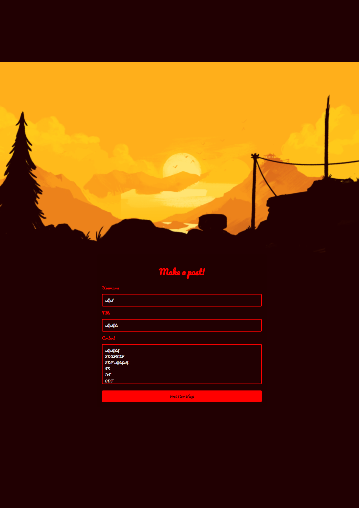
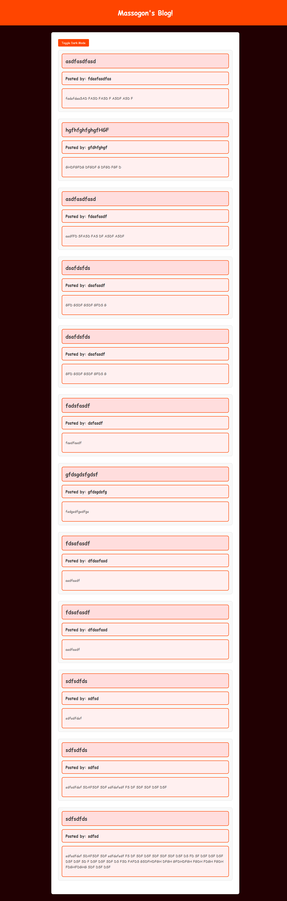

# Massogon's Blog

Massogon's Blog is a simple blogging platform where users can create, view, and toggle dark mode for blog posts. The project includes a form to create new blog posts, a page to display the posts, and a dark mode feature for better readability.

## Table of Contents
- [Features](#features)
- [Usage](#usage)
- [Project Structure](#project-structure)
- [Screenshots](#screenshots)
- [Technologies Used](#technologies-used)
- [Contributing](#contributing)
- [License](#license)

## Features
- Create new blog posts with a title, username, and content.
- View all blog posts dynamically loaded from localStorage.
- Toggle dark mode for a better reading experience in low-light conditions.

## Usage
### Creating a Blog Post
1. Open `index.html` in your browser.
2. Fill in the Username, Title, and Content fields.
3. Click "Post New Blog" to save the blog post.

### Viewing Blog Posts
1. Open `blogPost.html` in your browser.
2. All saved posts will be displayed dynamically.
3. Click the "Toggle Dark Mode" button to switch between light and dark modes.

## Project Structure

massogons-blog/
│
├── 02-Challenge/
│ ├── Assets/
│ │ ├── css/
│ │ │ ├── mainMenu.css
│ │ │ ├── blogPost.css
│ │ ├── images/
│ │ │ ├── [image files]
│ │ ├── js/
│ │ │ ├── script.js
│ │ │ ├── blogPost.js
│
├── index.html
├── blogPost.html
└── README.md

## Screenshots
### Blog Post Form
![Blog Post Form]

### Blog Post Page
![Blog Post Page]

## Technologies Used
- HTML
- CSS
- JavaScript

## Contributing
Contributions are welcome! Please fork this repository and submit a pull request for any features, fixes, or improvements.

## License
This project is licensed under the MIT License - see the [LICENSE](LICENSE) file for details.

